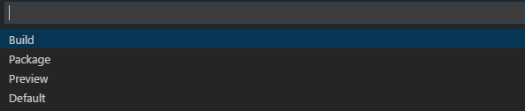
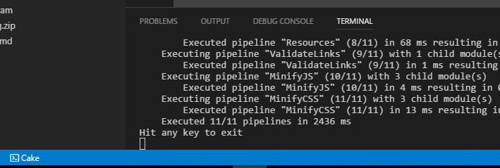

Title: Blogging flow in VS Code
Published: 22/02/2017
Tags: 
    - Cake
    - Wyam
    - VSCode
---
### Blogging flow in VS Code.

How to write a blog like it is the early 2000's... but better.

I use two extensions for writing my blog in VS Code.  
The first is the [Cake VSCode Plugin](https://marketplace.visualstudio.com/items?itemName=cake-build.cake-vscode). [On Github](https://github.com/cake-build/cake-vscode).  
The second is the [Cake Runner Plugin](https://marketplace.visualstudio.com/items?itemName=wk-j.cake-runner). [On Github](https://github.com/wk-j/vscode-cake-runner).  
 
The official Cake plugin is good as you get syntax highlighting and bootstrapping for Cake scripts.   
The runner is really cool. You can run all the cake tasks from within Visual Studio Code. 
`CTRL + SHIFT + T` launches the plugin options or there is a Cake icon in the bottom bar.  
If I hit Preview, which is a cake task I defined, it runs the cake watch and review in Code. 
 
I can then see the task run every time I save and go and check the Wyam hosted blog on localhost. 
 
 
If I wanted to, I could probably have a launch browser task in Cake and have it launch to the blog URL... 
Something to think about for later.  
 
Cheers 
Paul