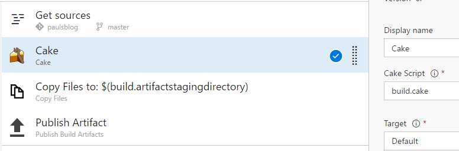

Title: Building with Cake
Published: 21/02/2017
Tags: Cake, Wyam, Build
---
### Why Cake?

<p>My name is Paul and I am a reformed build tool GUI user.</p>

<p>I used to build projects in TeamCity and VSTS by piecing together build steps and installing multiple plugins.<br>
It is addictive, kind of like Lego, grab a piece, put it in the right place and boom, your build spits out packaged code.<br>
I really like Lego.<br>
What I don't like is when it comes time to move the build and redoing a lot of work.<br></p>

<p>One day my boss came back from Build conf. Hey, I have just seen VSTS, I think we need to go with VSTS.<br>
Awesome, except we were just done upgrading TFS to 2015 because we wanted gated builds... There is no export to VSTS.<br>
We also had a bunch of build in TeamCity... How do you export that?<br>
You don't. You painstakingly find all the pieces and the dependancies and start the config from sratch in the WebUI.<br>
That is what we did. Moved all the git repos, started reconstructing all the builds. There has to be a better way.</p>

In my new role, I found they were using [PSake](https://github.com/psake/psake/). <br>
Psake is cool as it is all PowerShell, so if you know PowerShell, you can figure out PSake quickly.<br>
This post isn't about PSake though, it is about Cake.<br> 
My first Cake script was the one that builds and packages this blog.<br> 
My second is one that runs a SonarQube scan and build.<br>
Cake is batteries included as it can resolve dependancies through Nuget.<br>
Cake has an active development and plugin community which is awesome.<br>
Cake has a C# like syntax, although my coworker said it looked like JavaScript when he saw it. Your devs will get it.<br>
Version control is an amazing thing. Put the script in with your repo. You can build anywhere and keep track of changes.<br>
The best thing is a one step build on almost any build agent on almost any build server or system. Either powershell or a Cake runner in VSTS.<br>
I intend to have a lot more cake scripts in my life.<br>

Here is the VSTS build setup for this blog:<br>
<br>
That is all there is to it.<br>

Here is the actual code for my blog cake build:<br>
```C#
#tool nuget:?package=Wyam
#addin nuget:?package=Cake.Wyam
//////////////////////////////////////////////////////////////////////
// ARGUMENTS
//////////////////////////////////////////////////////////////////////

var target = Argument("target", "Default");

//////////////////////////////////////////////////////////////////////
// PREPARATION
//////////////////////////////////////////////////////////////////////

// Define directories.
var buildDir = Directory("./output");

// Devine output Zip file
var outputZip = "paulsblog.zip";

//////////////////////////////////////////////////////////////////////
// TASKS
//////////////////////////////////////////////////////////////////////

Task ("Clean")
    .Does(() =>
    {
        if (FileExists(outputZip)) {
            Information("Output zip found, deleting.");
            DeleteFile(outputZip);
        }

        if (DirectoryExists(buildDir)) {
            Information("Output directory found, deleting.");
            DeleteDirectory(buildDir, recursive:true);
        }
    });

Task("Build")
    .IsDependentOn("Clean")
    .Does(() =>
    {
        Wyam(new WyamSettings
        {
            UseLocalPackages = true
        });     
    });

Task("Package")
    .IsDependentOn("Build")
    .Does(() =>
    {
        Zip("./output", outputZip);
    });
    
Task("Preview")
    .Does(() =>
    {
        Wyam(new WyamSettings
        {
            Preview = true,
            Watch = true,
            UseLocalPackages = true
        });        
    });

//////////////////////////////////////////////////////////////////////
// TASK TARGETS
//////////////////////////////////////////////////////////////////////

Task("Default")
    .IsDependentOn("Package");

//////////////////////////////////////////////////////////////////////
// EXECUTION
//////////////////////////////////////////////////////////////////////

RunTarget(target);
```

The # statements are the dependancies.<br>
`var target = Argument("target", "Default");` defines the default target to be the Default target.<br>
I have two vars for the output zip and folder.<br>
`Clean` checks for the output folder and zip and deletes them is they exist.<br>
`Build` depends on clean and runs the Wyam build. I put a Wyam setting in to use a local package cache.<br>
`Package` is just zipping up the Wyam output folder and is dependant on Build. <br>
`Preview` allows me to run build.ps1 -target preview and update my preview blog as I type and save a post. <br>
<br>
`Task("Default").IsDependentOn("Package");` just tells cake to build the package step and it's dependancies if no target is specified.<br> 
<br>
That is all there is to it. Once Cake has done it's thing, I get a zip passed back to VSTS with my site in it ready for deployment. <br>
<br> 
Cheers<br>
Paul. 